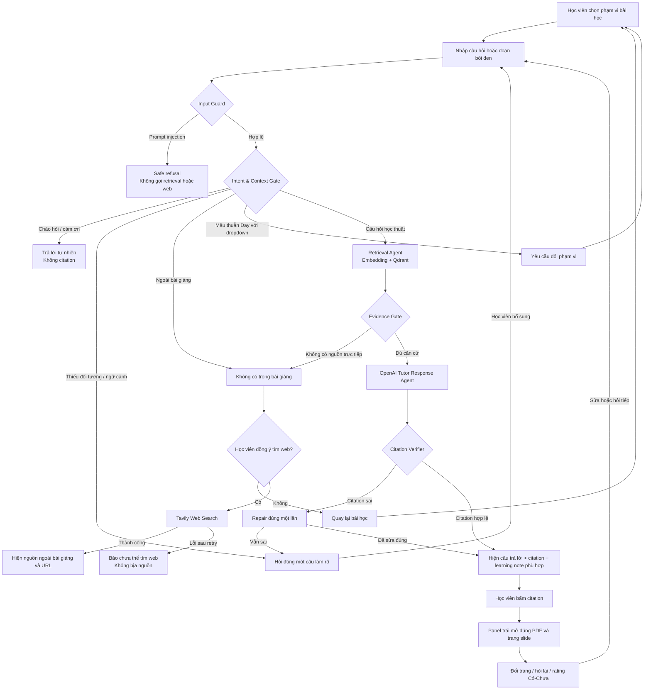

# CP2 — Hành trình tương tác VLearn Grounded Tutor

Prototype chạy ở mức **Working**. Giao diện nằm trong `src/`, bản build trong `dist/`; backend phục vụ luôn giao diện tại `http://localhost:8000`.

## Điểm có thể kiểm trực tiếp trên prototype

- Happy path: hỏi “LLM khác chatbot như thế nào?”, mở citation `[trang 10]`.
- Low-confidence: hỏi “Cái này hoạt động thế nào?”, agent phải hỏi lại và không có citation.
- Failure/no-grounding: hỏi thời tiết, agent phải xin consent trước khi tìm web.
- Correction: đổi dropdown Day 1/Day 2, bổ sung câu hỏi hoặc bấm rating ngay trong cuộc hội thoại.
- Safety: yêu cầu xem system prompt phải trả `safe_refusal` và không gọi tool.
