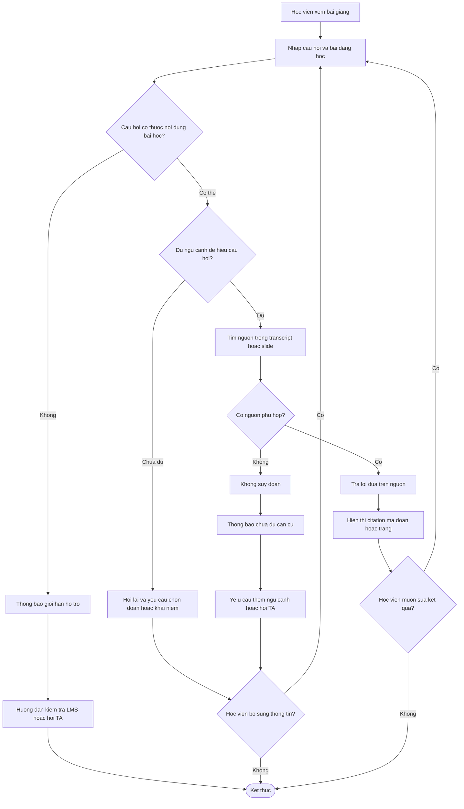

# CP2 — Sơ đồ flow Track A1

## Luồng chính

## Đọc sơ đồ theo 5 bước

1. Học viên đang xem bài giảng và nhập câu hỏi.
2. Hệ thống kiểm tra câu hỏi có thuộc phạm vi bài học không.
3. Hệ thống kiểm tra câu hỏi đã đủ ngữ cảnh chưa.
4. Nếu đủ ngữ cảnh, hệ thống tìm nguồn trong transcript/slide.
5. Có nguồn thì trả lời kèm citation; không có nguồn thì báo **Chưa đủ căn cứ**, không tự đoán.

## Các nhánh cần demo

| Nhánh | Input mẫu | Kết quả mong muốn |
|---|---|---|
| Happy path | `LLM là gì?` | Trả lời ngắn + citation, ví dụ `[D02, trang 5]` |
| Low-confidence | `Giải thích phần này` | Hỏi học viên chọn đoạn hoặc nêu khái niệm |
| Failure/no-grounding | `Dự báo thời tiết ngày mai thế nào?` | Báo chưa đủ căn cứ, không bịa câu trả lời |
| Ngoài phạm vi | `Deadline nộp bài là ngày nào?` | Hướng dẫn kiểm tra LMS hoặc hỏi TA |
| Correction | `Nó hoạt động thế nào?` rồi sửa thành `LLM tạo token tiếp theo thế nào?` | Nhận câu hỏi mới và chạy lại flow |

## Phân biệt CP2 và CP3

| Thành phần | CP2 | CP3 |
|---|---|---|
| Hình thức | Sơ đồ flow | Prototype chạy được |
| Retrieval | Mô tả/giả lập | Tích hợp tìm nguồn |
| AI model | Chưa bắt buộc | Gọi model thật |
| Citation | Minh họa | Sinh và kiểm tra từ nguồn |
| Log prompt/response | Chưa bắt buộc | Bắt buộc |

> Đây là sơ đồ CP2. Không cần chạy code ở CP2; chỉ cần trình bày rõ các bước và các nhánh xử lý.
